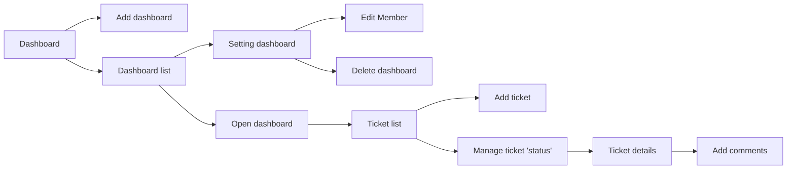

# Welcome to Tasker!
Tasker is a collaboration tool that **organizes your projects into boards**

## To make system ready
you must install **Django** and make **environment** the work ready

-you must make migrate, go to path manage.py
> python manage.py migrate

-you need to install bootstrap 4
> pip install django-bootstrap4

-now run system
> python manage.py runserver

## You can visit demo web
[Tasker](http://amrshadid.pythonanywhere.com)

## UML diagrams

